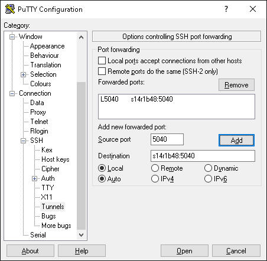
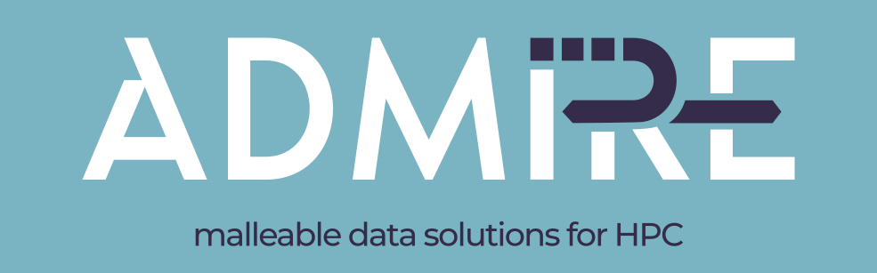
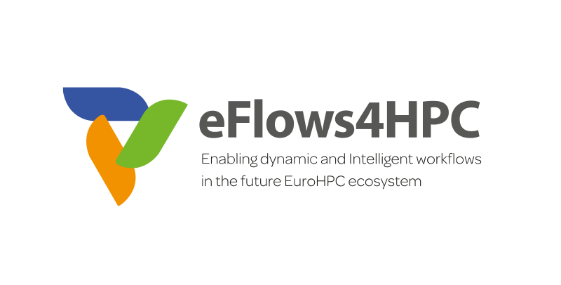

# PATC hands on

Welcome!

First part of the hands-on is contained in the `wordcount` folder. The solutions of the exercises can be found in the `wordcount-solutions` folder (the solution may not be unique, in case of doubt just ask). This part of the hands-on is done with Jupyter notebooks through a web browser.

If you don't have access to a `ssh` CLI command and use PuTTY instead, configure it as the image shows:

.

The dataClay hands-on is contained in the `matrices` folder. This part of the hands-on requires connecting to Mare Nostrum nodes.

---
<picture>
 
</picture><picture>
 
</picture>

> This project has received funding from the European Union’s Horizon 2020 JTI-EuroHPC research and innovation programme H2020-JTI-EuroHPC-2019-1, under grant agreements No: 955558 — eFlows4HPC, 956748 — ADMIRE
